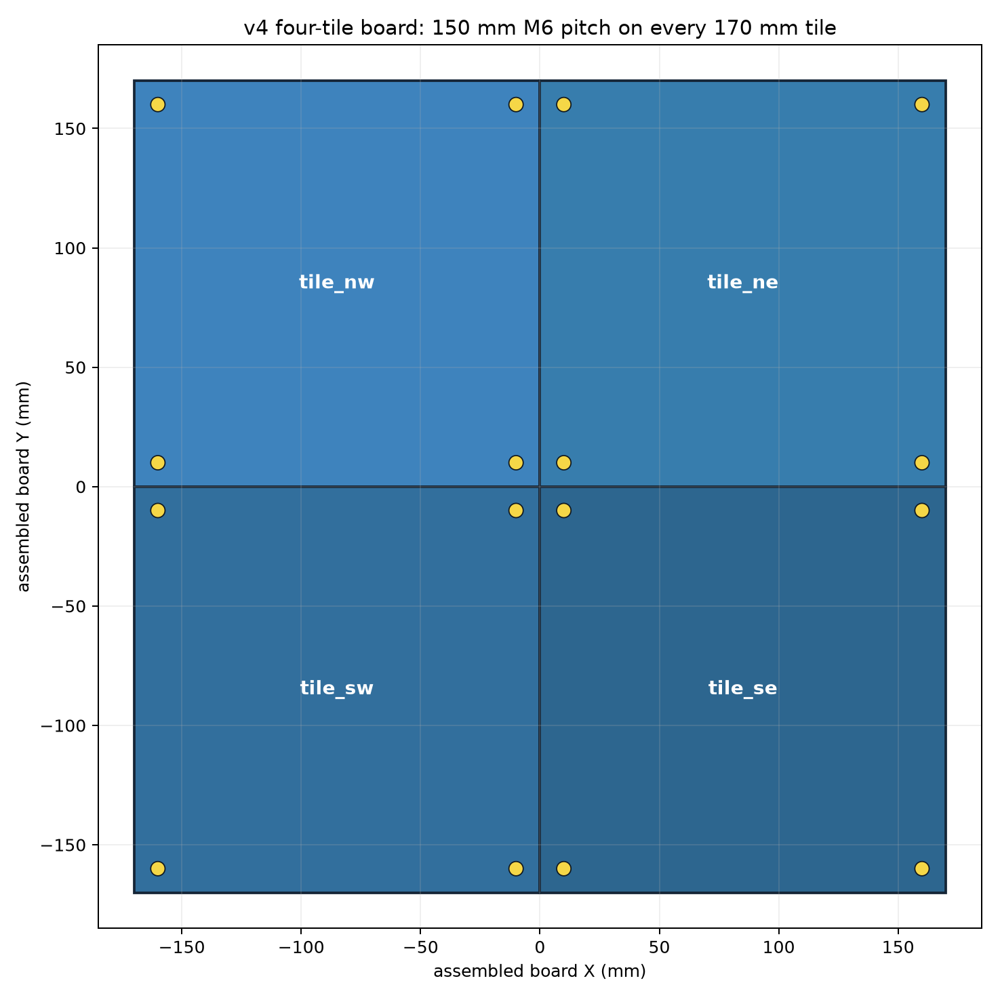

# TacTip GAN Coverage Board and CR3 Sampler

新版本 `cr3-2026.09.11`（带抬高横梁）：请先阅读 [版本说明](RELEASE_NOTES.md) 和 [改进说明与实测校正流程](README_CR3_IMPROVED.md)。本版本保存在独立分支，原 `main` 版本保持不变。下文保留上游说明；本次装置不能沿用旧 v1 托座的高度基准。实际 STL 和几何报告已加入 `hardware/`，离线路线可按说明重新生成。

这个仓库保存用于 TacTip sim-to-real GAN 数据采集的完整硬件与自动采样流程：

- 四块可打印的高凸起几何覆盖板 STL；
- 与 150 mm M6 孔距配合的 TacTip 校准托座；
- Dobot CR3 自动规划、IK 预检、视觉接触检测及触觉图像采集脚本；
- 采样板/托座重新生成与装配预览工具。

仓库中的默认硬件是实际用于 CR3 调试的 **v4 deep-contact 版本**。每块板为
`170 x 170 mm`，四块组装后为 `340 x 340 mm`；每块板的四个 M6 孔中心距为
`150 x 150 mm`，板孔直径为 `6.0 mm`。



## Repository layout

```text
tools/
  auto_cr3_v4_150mm_coverage_board_sampler.py   # 推荐入口
  auto_cr3_coverage_board_sampler.py            # 完整规划与采集实现
  preprocess_tactip_markers.py                  # 批量 Hough + 颜色二值化
  tactip_hough_chromatic.py                     # 批处理与在线采样共用算法
  tactip_runtime_preprocess.py                  # 自动采样在线预处理封装
  ...                                           # CR3、相机、预处理与硬件生成依赖

outputs/tactile_gan_coverage_board_v4_highprotrusion_deepcontact_70mm_mountpitch150/
  tactile_gan_coverage_board_340mm_tile_*.stl   # 四块打印板
  tactile_gan_coverage_board_340mm_manifest.json
  tactile_gan_coverage_board_340mm_sampling_sites.csv
  tactile_gan_coverage_board_340mm.urdf
  tactip_calibration_dock_lightweight_v1/       # 默认且经过实机流程使用的托座
  tactip_calibration_dock_verified_pitch_v2/    # 可选 150 mm 封闭孔夹持版

tactile_sim2real/pairing.py                     # 配对计划辅助模块
```

不会提交机器人专用的 fixture profile、Tool(2) TCP 或实物采样运行结果。每台机器、
每次重新安装托座后都必须重新示教。

## Installation

Python 3.10 或更高版本：

```bash
python3 -m venv .venv
source .venv/bin/activate
python -m pip install --upgrade pip
python -m pip install -r requirements.txt
```

macOS 还需要在“系统设置 -> 隐私与安全性 -> 相机”中允许 Terminal/Python 使用相机。
`tkinter` 由 Python 系统安装提供，不在 `requirements.txt` 中。

## TacTip image preprocessing

默认预处理已替换为 Hough 圆边界检测与蓝黄颜色过滤：

1. 灰度梯度只用于 Hough 圆周投票，不寻找最亮像素；
2. 对每个圆内部计算 `2B-G-R` 中位数，保留蓝灰 marker，排除金黄玻璃反光；
3. 使用当前图片实测的圆心和半径生成严格 `0/255` 二值图；
4. 原分辨率与 `256 x 256` 输出都必须保持 331 个独立连通域，否则拒绝该帧；
5. 原始相机照片永远保留，不会被预处理图覆盖。

处理单张图片：

```bash
.venv/bin/python tools/preprocess_tactip_markers.py \
  --input /absolute/path/to/tactip.png \
  --output-dir outputs/preprocessed_test
```

处理文件夹：

```bash
.venv/bin/python tools/preprocess_tactip_markers.py \
  --input /absolute/path/to/raw_images \
  --glob '*.png' \
  --output-dir outputs/preprocessed_batch
```

自动采样器默认启用同一套算法，标准模型输入保存在
`tactip_preprocessed/model_input_256/`。使用 `--no-tactip-preprocess` 可以只保存原图。
当前默认参数以 1280×960 实拍图为基准，圆间距、半径和 ROI padding 会随输入分辨率
自动缩放；颜色阈值保持在原始 8-bit BGR 色域中。

## Print and assemble

1. 打印 `tile_nw`、`tile_ne`、`tile_sw`、`tile_se` 四个 STL，触觉几何朝上。
2. 按 NW/NE、SW/SE 的顺序组装，不能单独旋转某一块。
3. 使用四角 `6.0 mm` M6 孔把每块板固定在同一平面上。
4. 默认托座安装在当前板块的 local `-Y` 边，并共用南侧两个 150 mm 间距的孔。
5. TacTip 刚性外壳落入圆形定位环，软触头朝下，电缆从外侧开槽离开。

默认托座及装配图位于：

```text
outputs/tactile_gan_coverage_board_v4_highprotrusion_deepcontact_70mm_mountpitch150/
  tactip_calibration_dock_lightweight_v1/
```

`verified_pitch_v2` 是更刚性的封闭孔替代版。更换托座版本后必须使用相应的 design
JSON，并重新示教 fixture profile；不能复用旧托座的 TCP。

## Safe workflow

以下命令都要在仓库根目录运行。示例使用 `tile_nw`、CR3 地址
`192.168.31.88`、Tool 2。

### 1. Teach the seated dock pose

先手动把 TacTip 完全落入托座，再执行：

```bash
.venv/bin/python tools/auto_cr3_v4_150mm_coverage_board_sampler.py \
  --tile tile_nw \
  --teach-dock-from-current \
  --robot-ip 192.168.31.88 \
  --tool 2
```

此步骤只读取当前位置，不发送运动指令。

### 2. Generate a 2,000-sample plan without moving CR3

```bash
.venv/bin/python tools/auto_cr3_v4_150mm_coverage_board_sampler.py \
  --tile tile_nw \
  --samples-per-tile 2000 \
  --dense-spatial-layout region_grid \
  --dense-region-anchor-count 25 \
  --min-post-contact-depth-mm 1 \
  --max-post-contact-depth-mm 10 \
  --output-dir outputs/plans/tile_nw_2000
```

输出包括 CSV、JSON 和可旋转 HTML 规划预览，不连接相机，也不移动机械臂。

### 3. Optional controller IK preflight without motion

正常采样默认跳过这一步，避免对 2,000 个采样点逐一请求控制器 IK 而等待数分钟。
实际每个 `MovL` 仍会在发送前进行一次即时 IK 检查。只有在首次更换夹具、工作空间或
Tool 参数后，才建议单独执行下面的完整无运动检查：

```bash
.venv/bin/python tools/auto_cr3_v4_150mm_coverage_board_sampler.py \
  --tile tile_nw \
  --samples-per-tile 2000 \
  --dense-spatial-layout region_grid \
  --dense-region-anchor-count 25 \
  --min-post-contact-depth-mm 1 \
  --max-post-contact-depth-mm 10 \
  --ik-preflight-only \
  --robot-ip 192.168.31.88 \
  --tool 2
```

采样器会检查 `site_high`、approach、contact、最深压入及 retreat，并用候选点替换
不可达点；该模式不会发送 MovL。

### 4. Real collection

先只使用 `--max-samples 1 --first-contact-test` 做有人看护的 1 mm 首次接触测试。
确认坐标、方向、接触检测和回程都正确后，直接运行完整批次；不需要先执行步骤 3。
若希望在正式采样前再次做完整路线筛选，可在执行命令中显式加入
`--preflight-all-routes`。

```bash
.venv/bin/python tools/auto_cr3_v4_150mm_coverage_board_sampler.py \
  --tile tile_nw \
  --samples-per-tile 2000 \
  --dense-spatial-layout region_grid \
  --dense-region-anchor-count 25 \
  --min-post-contact-depth-mm 1 \
  --max-post-contact-depth-mm 10 \
  --camera-source 0 \
  --robot-ip 192.168.31.88 \
  --tool 2 \
  --speed 3 \
  --allow-depth-above-csv-limit \
  --return-to-dock \
  --execute \
  --yes-i-confirm-cr3-is-safe
```

`--allow-depth-above-csv-limit` 只能在已经物理验证板材、固定方式与 TacTip 能承受
1-10 mm 协议后使用。

## Safety

- 未同时提供 `--execute` 和 `--yes-i-confirm-cr3-is-safe` 时，脚本不会发送运动。
- 新装夹必须先生成预览，再执行 IK preflight，最后进行单点低压入测试。
- 自动 IK 只能检查运动学可达性，不能替代完整机械臂、线缆、夹具和环境碰撞检查。
- 接触失败默认安全回到高位并停止批次；不要在不检查机器人状态时盲目续跑。
- 急停、保护空间、速度限制和现场看护仍由操作者负责。
