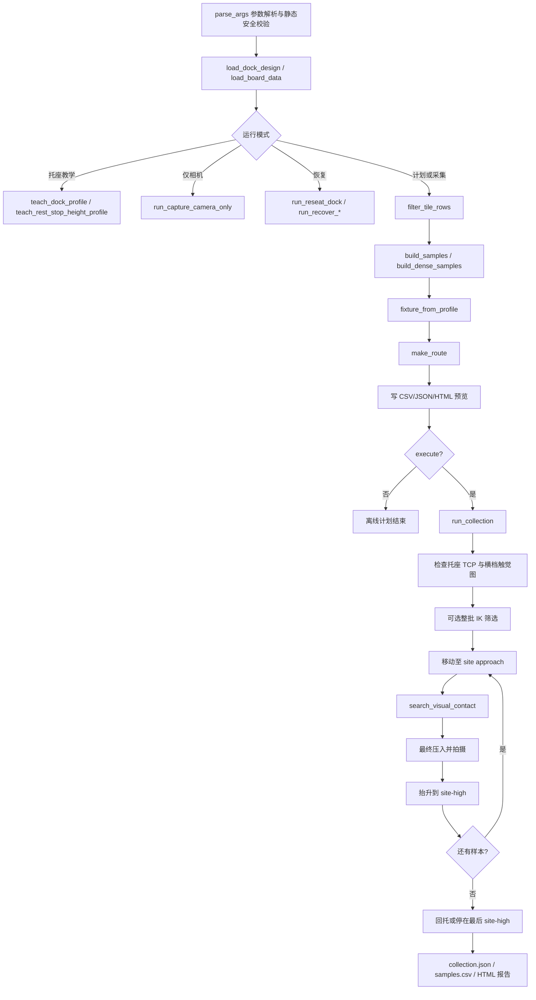

# `auto_cr3_coverage_board_sampler.py` 详细说明

> 源文件：`tools/auto_cr3_coverage_board_sampler.py`<br>
> 适用版本：2026-09-16 当前工作区版本（约 5,271 行）<br>
> 目标读者：需要理解、运行、调试或继续开发 CR3 + TacTip 覆盖板自动采样流程的研究人员

## 1. 这个脚本解决什么问题

这个脚本是四块 GAN 触觉覆盖板的真实机械臂采样入口。它把下面几件本来相互独立的事情串成一个受约束的流程：

1. 从固定 TacTip 托座建立真实 CR3 坐标系与板子 CAD 坐标系之间的刚体关系。
2. 根据板子 manifest、采样点 CSV 和解析几何生成触觉采样计划。
3. 把每个板上采样点换算成 CR3 基座坐标系中的 TCP 位姿。
4. 在运动前检查起始托座状态、Tool/User、IK、运动反馈和深度上限。
5. 在每个点建立新的无接触图像基线，再用 marker 光流寻找真实接触。
6. 从视觉接触点继续压入指定深度并保存原图、预处理图、TCP 和统计量。
7. 处理无接触、断点续采、整批 IK 筛选、回托以及受限恢复。
8. 输出可复核的 CSV、JSON、HTML 轨迹和图像报告。

它不是单纯的“读 CSV 后逐点 `MovL`”脚本。它同时承担了坐标配准器、采样规划器、视觉接触检测器、机器人安全门、数据记录器和恢复工具的职责。

## 2. 最重要的设计原则

### 2.1 托座是机械配准基准

脚本不在每次运行时重新拟合任意三维点。TacTip 放入具有机械键位的固定托座后，保存的 Tool(2) TCP 和托座设计文件共同确定板子坐标系。

对于带横档的托座，profile 会保存 TacTip 接触横档时的触觉图像。普通正式运行必须同时满足：

- 当前 Tool(2) TCP 与保存的托座 TCP 相符；
- 当前触觉图像与保存的横档接触图像相符。

因此，“TCP 在附近但 TacTip 没真正落到底”不会被当成有效归位。

`scripts/run_tile_ne_331pin_formal2000.sh` 额外固定启用了
`--refresh-dock-reference-at-start`。它适用于已把 TacTip 放入横档托座、但本次更换或旋转了 TacTip
头/相机的情况：开始采样时不再比较上一次的图。若当前 TCP 仅在**同一根固定横档**正上方 `0.1-5 mm`，并且横向偏差不大于 `0.5 mm`、姿态偏差不大于 `0.75°`，脚本会以 `1%` 速度自动回落到保存的横档 TCP，然后拍摄两张新的横档图。
这个启动步骤**绝不会改写** `dock_tcp`、横档高度、`height_calibration` 或
`board_yaw_deg`。它只更换 `tactile_rest_stop_reference`：新图互相用于稳定性检查，旧图不参与本次判定。若超出这个严格回落包络，脚本才停止并报错，而不会用一个未知位置错误地重新定义高度。

### 2.2 CAD 高度只负责给出名义位置

模型提供每个点的名义表面高度，但最终是否接触由实时触觉图像决定。实际流程是：

```text
CAD 名义表面
    -> 从上方逐步接近
    -> marker 位移达到动态阈值
    -> 得到视觉接触点
    -> 再压入该样本要求的 1-10 mm
```

这样可以吸收打印误差、装配高度误差和局部曲面高度差，但搜索仍受硬深度上限约束。

### 2.3 每个真实 `MovL` 前都做即时 IK

默认不会在 2,000 点运行前等待整批 IK 扫描，但 `move_and_verify()` 会在每个真实 `MovL` 前读取当前关节角，并用相同 near-joint 分支调用控制器 `InverseSolution`。没有解时不会发送该次 `MovL`。

`--preflight-all-routes` 是额外的整批筛选，不是即时 IK 的替代品。

### 2.4 失败时不猜测机器人位置

如果 `GetPose`/`GetAngle` 反馈无效、运动误差超限或异常发生在未知阶段，脚本记录错误并停止，不会擅自发送恢复动作。只有起点落在明确限定的几何包络中时，专用恢复模式才允许移动。

## 3. 总体架构



## 4. 外部模块边界

主脚本负责组织流程，但以下能力来自同仓库其他模块：

| 模块 | 主脚本使用的能力 |
|---|---|
| `auto_cr3_gelsight_pair_sampler.py` | `GelSightCapture`：打开相机、后台读取带时间戳的新帧 |
| `auto_cr3_visual_contact_search.py` | 多帧中值拍摄、marker 光流统计、位姿误差、`move_and_verify()`、动态图像阈值 |
| `design_tactile_gan_coverage_board_modular.py` | 根据区域 profile、stimulus 和局部 X/Y 解析计算曲面 Z 高度 |
| `live_cr3_gelsight_sampler.py` | `DobotCR3LiveClient`、相机 source 解析、CR3 TCP/IP 命令 |
| `runtime_board_height_datum.py` | 运行时板高基准的绑定、质量检查、生成与加载 |
| `tactip_runtime_preprocess.py` | 331-pin Hough/色彩筛选、原分辨率 marker 图、256x256 模型输入 |

需要特别区分：本文件决定“什么时候拍、什么时候移动、拍完如何判断”；marker 的具体检测和 LK 光流计算在外部模块中实现。

## 5. 输入文件

### 5.1 板子目录 `--board-dir`

目录中必须恰好有一个 `*_manifest.json`。manifest 至少需要描述：

- 四块 tile 的 `tile_id`、中心坐标和 STL；
- 每块 tile 包含哪些 `region_id`；
- 采样 CSV 的相对路径；
- `height_profile`；
- 区域中心、TacTip 名义直径和安全特征区尺寸。

采样 CSV 至少被脚本使用的列包括：

- `site_id`、`region_id`、`category`、`stimulus`；
- `board_x_mm`、`board_y_mm`、`expected_surface_z_mm`；
- `sampling_jitter_radius_mm`；
- `recommended_depth_min_mm`、`recommended_depth_max_mm`。

### 5.2 托座设计 `--dock-design`

JSON 必须属于支持的 schema，并包含：

- `tactip_reference.nominal_seated_tool_tcp_local_mm`；
- 对应的 `tool` 编号；
- 可选 `rest_pose_stop`：横档接触中心和顶面高度；
- 可选 `reference_pad`；
- 可选 STL 路径，仅用于预览。

`geometry_preview_only` 文件可以做离线可视化，但不能授权教学、标高或真实运动。

### 5.3 实物配准 profile `--fixture-profile`

由本脚本教学模式生成，包含：

- 保存的真实 `dock_tcp`；
- Tool、User、tile；
- 托座设计文件 SHA-256；
- 固定 `board_yaw_deg`；
- 横档高度标定和触觉参考图（v3 profile）。

加载时会核对 tile、Tool、User 和托座设计哈希，避免把另一次装夹的 profile 误用于当前实物。

## 6. 坐标系与数学关系

### 6.1 三个核心坐标系

| 坐标系 | 含义 |
|---|---|
| tile local | 板子 CAD 坐标；采样点、区域中心和安全高度都在这里定义 |
| CR3 base | 机器人 `GetPose`/`MovL` 使用的基座坐标 |
| Tool local | Tool(2) 的末端坐标；Tool `+Z` 被定义为真实压入方向 |

保存 profile 时采用以下方向约定：

```text
tile +X = 托座位姿下 Tool +X
tile +Y = 托座位姿下 Tool -Y
tile +Z = 托座位姿下 Tool -Z（物理向上）
Tool +Z = 物理压入方向（向板面）
```

### 6.2 `FixtureTransform` 的变换

固定轴适配矩阵为：

```text
A = diag(1, -1, -1)
```

如果保存的托座旋转矩阵是 `R_dock`，固定板面偏航角是 `R_yaw`，则：

```text
R_tile_to_base = R_dock * A * R_yaw
```

tile-local 点 `p_local` 转为 CR3 base 点：

```text
p_base = p_dock_base + R_tile_to_base * (p_local - p_dock_local)
```

反变换由 `base_to_tile_local()` 完成：

```text
p_local = p_board_centre_local
        + R_tile_to_base^T * (p_base - p_board_centre_base)
```

固定托座路径和预览另用 `base_to_fixed_fixture_local()`，因此改变采样板朝向不会错误地旋转托座回位路线。

### 6.2.1 每批自定义采样板朝向

`board_yaw_deg` 是写进 fixture profile 的**原始安装基准**，不应在已经完成托座/横档高度校准后手工改写。若同一块板以不同朝向装到同一固定托座上，采样时使用：

```text
effective_yaw_deg = saved_profile_yaw_deg + board_yaw_offset_deg
```

运行参数 `--board-yaw-offset-deg <角度>` 只改变本批次的 tile-local `X/Y`、采样点和倾斜轴。旋转中心是采样板几何中心 `(0, 0)`；托座、横档和 rest TCP 留在固定位置。它**不会**修改：

- 已保存的 `dock_tcp`；
- 横档高度/运行时高度 datum；
- fixture profile 本身；
- TacTip 归位位置。

正值采用 tile local 的右手规则：`+X` 朝 `+Y` 旋转。常用的四个装夹方向是 `0`、`90`、`-90` 和 `180` 度；但从 TacTip 向下看的“顺/逆时针”会受观察视角影响，必须先运行无 `--execute` 的 HTML 预览确认正负号。每个 `sampling_plan.json`、`collection.json` 和 `README.md` 都记录保存角、运行偏移角和最终有效角。

Jogger 中的旋转按钮只修改待规划角度。已经打开的 HTML 是静态文件，不会原地改变；角度修改后旧预览按钮会被禁用，必须点击 **Plan Route (No Robot Motion)**。新预览使用固定托座坐标系：蓝色实体采样板绕黄色中心点旋转，橙色托座保持不动。

### 6.3 倾角与压入轴

`tilt_x_deg` 和 `tilt_y_deg` 分别绕已经映射到 base 坐标中的 tile X、Y 轴旋转。最终方向为：

```text
R = R_tilt_y * R_tilt_x * R_dock
press_axis_base = R * [0, 0, 1]^T
```

因此压入不是简单修改 CR3 的 Z 值，而是沿当前 Tool `+Z` 在 base 坐标中的单位向量运动。倾斜采样时 X、Y、Z 都可能同时变化。

### 6.4 Euler 角的数值连续性

同一个旋转可以写成 `+178°` 或 `-182°`。`FixtureTransform.pose()` 会把新 Euler 角包裹到靠近托座保存角度的等价值，便于检查计划，也减少控制器看到不必要的 360° 数值跳变。

## 7. 核心数据结构

### 7.1 `FixtureTransform`

冻结 dataclass，保存一次装夹的刚体映射。

| 字段/方法 | 作用 |
|---|---|
| `dock_tcp` | 实测托座 Tool TCP，6 维 |
| `dock_tcp_local_mm` | 同一基准在 CAD/tile local 中的 3D 坐标 |
| `tile_to_base` | tile local 到 CR3 base 的 3x3 旋转矩阵 |
| `dock_rotation` | 托座 TCP 本身的旋转矩阵 |
| `board_yaw_deg` | 装夹中固定的板面偏航角 |
| `position()` | 只变换位置 |
| `orientation()` | 生成带 X/Y 倾角的末端旋转 |
| `pose()` | 生成完整 X/Y/Z/Rx/Ry/Rz |
| `press_axis()` | 得到 base 坐标中的真实压入轴 |
| `local_vector()` | 把 base 中的位移向量旋回 tile local |

### 7.2 `BoardSample`

每个计划样本的不可变记录。关键字段分为四组：

| 组 | 字段 |
|---|---|
| 身份 | `index`、`sample_id`、`tile_id`、`source_seed_site_id`、`region_id` |
| 物理类别 | `category`、`stimulus`、`replicate` |
| 接触位置 | `local_contact_mm`、`expected_surface_z_mm`、`jitter_x_mm`、`jitter_y_mm` |
| 接触条件 | `post_contact_depth_mm`、`tilt_x_deg`、`tilt_y_deg` |

`local_contact_mm` 是 tile 中的名义零接触点；`post_contact_depth_mm` 是视觉找到真实接触后继续压入的量，两者不能混为一谈。

## 8. 运行模式与分派顺序

`run()` 按以下优先级分派。前面的模式命中后不会继续执行后面的普通采样逻辑。

| 顺序 | 模式 | 是否连接 CR3 | 是否运动 |
|---:|---|---:|---:|
| 1 | `--capture-camera-only` | 否 | 否 |
| 2 | `--calibrate-height-from-rest-stop` | 是 | 否 |
| 3 | `--teach-dock-from-current` | 是 | 否 |
| 4 | `--recover-low-pose-to-dock` | 是 | 取决于 `--execute` |
| 5 | `--calibrate-runtime-height` | 是 | 是 |
| 6 | 普通规划、预览、预检或采集 | 视后续参数而定 | 视后续参数而定 |

普通规划完成后又按以下优先级执行：

1. `--reseat-dock-only`
2. `--recover-reference-to-dock`
3. `--verify-dock-tactile-reference-only`
4. `--ik-preflight-only`
5. 没有 `--execute`：仅输出计划
6. 有 `--execute`：进入 `run_collection()`

## 9. 一次正式采集的完整时序

### 9.1 离线阶段

1. 解析参数并拒绝不兼容组合。
2. 加载托座设计、板子 manifest 和采样 CSV。
3. 按 tile、region、site 筛选 CSV。
4. 生成普通或精确数量的 dense 样本。
5. 应用零倾角、首点测试、断点续采等变换。
6. 加载 fixture profile，并检查哈希与 Tool/User。
7. 生成每个样本的名义 contact、approach、site-high 和最深允许点。
8. 写出计划 CSV/JSON 和交互式 HTML；此阶段不会连接机械臂。

### 9.2 连接设备后的起始安全门

1. 打开相机并创建预处理器。
2. 连接 CR3，设置 User/Tool，要求机器人可运动且空闲。
3. 读取当前关节和 TCP。
4. `dock_alignment_decision()` 把状态分为：
   - `already_seated`：在托座容差内；
   - `aligned_above_dock`：XY/姿态几乎完全对齐，只在托座上方 0.1-5 mm；
   - `unsafe_start_pose`：其余状态。
5. 第二种状态默认允许以不高于 1% 的速度纯竖直回落到保存 TCP；第三种状态拒绝移动。
6. 对有横档的托座，再拍一张实时触觉图，与保存参考比较 marker 位移、纹理相关性和归一化 MAE。

### 9.3 离开托座与整批 IK 策略

默认不接触额外 reference pad，而是：

```text
seated dock -> dock_exit
```

然后确认实际 TCP 已到 `dock_exit`。如果启用 `--preflight-all-routes`，此时检查候选池并用可达备用点替换不可达点；默认则保留原计划，只在每次真实运动前做即时 IK。

### 9.4 单样本运动与接触

普通非连续模式的进场路线：

```text
dock_exit -> dock_high -> site_high -> approach
```

连续模式除首点外的进场路线：

```text
previous site_high -> next site_high -> approach
```

到 approach 后：

1. 拍无接触 baseline。
2. 原地拍多组 noise probe，计算当前点自己的阈值。
3. 沿 `press_axis_base` 每次最多移动 0.5 mm。
4. 每步拍新图并计算 marker 位移 mean 和 P95。
5. 两项均超过阈值才算 hit。
6. 在同一 TCP 再拍，达到 `consecutive_hits` 才确认接触。
7. 沿同一压入轴继续移动 `post_contact_depth_mm`。
8. 拍最终 capture，保存图像与实际 TCP。
9. 抬升回 site-high。

### 9.5 批次结束

默认通过 dock-high、dock-exit 回到保存的托座 TCP。也可以用 `--leave-at-site-high` 留在最后一个 site-high，但这只适合诊断。

## 10. 样本规划模块

### 10.1 CSV 筛选

`filter_tile_rows()` 先按当前 tile 的 `region_ids` 过滤，再应用可重复的 `--region` 和 `--site`。不存在的 region/site 立即报错，不会静默忽略。

### 10.2 quick / standard / dense profile

没有 `--samples-per-tile` 时使用 profile：

| profile | seed 选择 | 每个 seed 重复数 |
|---|---|---:|
| `quick` | 只取编号 1、5、9 | 1 |
| `standard` | 全部 | 2 |
| `dense` | 全部 | 4 |

倾角从 `TILTS_BY_CATEGORY` 中按类别轮换。flat/curvature/multi-touch 最大约 3°，edge X 方向可到 4°，small-feature 最大约 2°。

### 10.3 精确数量 dense 计划

提供 `--samples-per-tile N` 后，`build_dense_samples()` 保证最终恰好生成 N 个样本：

1. 在选择到的 region 间尽量平均分配数量。
2. 默认 `region_grid` 在每个区域建立正方形锚点阵列。
3. 锚点窗口会扣除 TacTip 半径，避免圆形触头跨入相邻单元。
4. 每个格点加入不超过单元尺寸 10% 的确定性低差异扰动。
5. 用互质 stride 遍历锚点，先覆盖全部位置再重复。
6. 每个实际 X/Y 绑定最近的 CSV seed，用它的类别、stimulus 和安全压深区间。
7. 用解析曲面函数重新计算该 X/Y 的表面 Z，而不是复制最近 seed 的 Z。
8. 压深和倾角都由带 seed 的低差异序列产生，因此可复现。

如果明确指定 `--site`，默认的 `region_grid` 会自动变成围绕该 seed 的 `seed_jitter`，用于局部重复实验。

### 10.4 压深分布

默认全局要求是 1-10 mm，但 `--respect-csv-depth-limits` 默认开启。每个样本实际允许范围为：

```text
lower = max(全局最小值, CSV 推荐最小值)
upper = min(全局最大值, CSV 推荐最大值)
```

没有交集会在规划阶段报错。区间内使用 base-5 低差异序列，而非普通伪随机数。

使用 `--ignore-csv-depth-limits` 时，真实执行如果存在超出 CSV 上限的样本，还必须显式增加 `--allow-depth-above-csv-limit`。

### 10.5 IK 备用候选池

只在整批 IK 预检时需要。候选数为：

```text
ceil(请求样本数 * ik_candidate_multiplier)
```

默认倍数是 2。备用点继续同一确定性 dense 序列，因此替换不可达点时不会跳出已知安全区域，也不会破坏每个 region 的目标数量。

## 11. 路线规划模块

### 11.1 `make_route()` 生成的关键位姿

| 位姿 | 含义 |
|---|---|
| `contact_tcp` | CAD/高度校正后的名义零接触位姿 |
| `approach_tcp` | 沿压入轴反方向退 `approach_clearance_mm` |
| `site_high_tcp` | 相同 X/Y、配置的 tile-local 安全高度 |
| `dock_exit` | 从托座基准沿 tile +Z 纯竖直抬升 |
| `dock_high` | 托座 X/Y 上方的公共安全高度 |

板高 correction 只作用于板面 contact/approach；托座和公共安全高度不跟着改变。对 site-high 的 correction 还会去掉任何会降低安全面的法向分量。

### 11.2 最深允许 TCP

对样本压深 `d` 和接触搜索余量 `m`：

```text
maximum_below_nominal = min(全局硬上限, d + m)
```

视觉找接触本身最多走到：

```text
max_contact_depth_from_approach
    = approach_clearance + maximum_below_nominal - d
```

找到接触后再压入 `d`。因此最终 capture 不会深于名义面下 `maximum_below_nominal`。这里特意为最终压入预留了空间，不能把“接触搜索距离”和“压入深度”直接相加两次。

### 11.3 连续采样模式

`--continuous-board-transit` 不会在每个点后回托：

```text
contact -> current site_high -> next site_high -> next approach
```

所有横向运动仍在共同的 `safe_height_mm` 完成。它显著提高效率，但不会取消每次 `MovL` 的即时 IK 和反馈检查。

## 12. 视觉接触检测模块

### 12.1 图像输入

默认相机设置为 1280x960、30 fps。每次“拍一张”不是取单帧，而是读取若干质量合格的新帧后做逐像素中值，降低闪烁和偶发模糊。

严格预处理要求每张被接受图像独立检测到配置数量的 marker（默认 331）。检测失败时只重拍新图，不会从上一张图补点。

### 12.2 每个采样点都有独立 baseline

`prepare_site_baseline()` 在 approach 位姿执行：

1. 用 `baseline_frames` 拍 baseline。
2. 原地再拍 `noise_probes` 组图。
3. 每组都与 baseline 计算去除整体相机运动后的局部 marker 位移。
4. 分别得到 mean 和 P95 的噪声序列。

动态阈值公式为：

```text
threshold = max(
    人工下限,
    noise_median + noise_multiplier * max(1.4826 * MAD, 0.05)
)
```

默认人工下限：mean 0.10 px，P95 0.45 px。

### 12.3 命中规则

某一步只有同时满足以下条件才是 contact evidence：

```text
marker_motion.mean >= threshold.mean
AND
marker_motion.p95 >= threshold.p95
```

之后保持同一位姿再次拍摄。默认至少连续命中两次；高度测量和运行时标高会强制至少三次。

### 12.4 为什么在同一位姿确认

确认帧不会继续向下移动。这样首个命中 TCP 仍对应同一个机械位置，也不会因为“为了确认又压了一步”而消耗最后的深度预算。

### 12.5 高度测量的 bracket refinement

普通数据采集只需要稳定找到接触。`--height-measurement` 还要估计接触阈值所在的窄区间：

1. 先记录最后一个 no-contact TCP 和第一个 contact TCP。
2. 回到 no-contact 端确认已经释放。
3. 在已探索区间内按最多 0.02 mm 步长重新前进。
4. 只接受宽度不超过 0.04 mm 的正 bracket。

它测量的是“图像检测阈值接触”，不是力传感器定义的严格零力接触。

运行时全板高度标定故意使用已经稳定确认的 0.5 mm 粗 bracket，不在已形变、可能有反光的图像中继续多次细探。

### 12.6 中间图像的保留策略

默认只保留最终 capture。baseline、noise、search 和 confirm 图在统计用完后删除，以免 2,000 点实验被中间帧占满磁盘。

使用 `--save-search-frames` 可保留全部诊断图；高度测量会自动开启它。

## 13. IK 与运动反馈模块

### 13.1 即时运动保护

每次 `move_and_verify()` 的顺序是：

1. 验证目标是 6 个有限数值。
2. 读取 `RobotMode`，只接受 enabled and idle 状态 5。
3. 读取当前关节角作为 near-joint 分支提示。
4. 调用控制器 `InverseSolution`。
5. 只有 IK 成功才发送 `MovL`。
6. 运动结束后读取真实 `GetAngle` 和 `GetPose`。
7. 再次检查 RobotMode。
8. 对比目标与真实 TCP，默认限值 0.75 mm / 1.5°。

如果真实反馈缺失，不能把命令目标冒充成测量结果；脚本抛错并禁止自动恢复。

### 13.2 整批 IK 预检

`--preflight-all-routes` 对每个候选检查五个分支连续的目标：

1. site-high
2. approach
3. planned contact
4. deepest capture limit
5. 从最深点分支返回 site-high

每一个 IK 解都会成为下一个目标的 near-joint 提示，因此检查的是一条连续关节分支，而不只是每个 TCP 是否存在任意解。

无 near-hint 的 IK 查询仅在 `--ik-diagnose-failures` 下用于诊断“真不可达”还是“当前分支不可达”；它即使成功也不会授权候选点。

### 13.3 精确缓存

整批过滤可缓存成功 IK，key 包含完整目标 pose、完整 near-joints、User 和 Tool，不做数值舍入。这个缓存只存在于无运动筛选阶段；真实 `MovL` 前仍重新查询控制器。

## 14. 托座、高度与配准模块

### 14.1 传统托座教学

`--teach-dock-from-current` 对无横档的旧托座只读取当前 TCP，不移动，并写 v1 profile。

### 14.2 横档托座标定

带 `rest_pose_stop` 的托座无论使用 `--teach-dock-from-current` 还是 `--calibrate-height-from-rest-stop`，都会进入强化流程：

1. 验证横档接触点与 nominal seated TCP 在 CAD 中一致。
2. 间隔 0.25 秒读取两次 TCP，要求机械臂稳定。
3. 拍主参考图。
4. 静置后拍重复图。
5. 从两图的 marker motion 和纹理差异建立接受带。
6. 写入 v3 fixture profile 和独立参考图目录。

### 14.3 正式运行的横档触觉核验

实时图与参考图比较：

- 局部 marker motion mean；
- 局部 marker motion P95；
- 鲁棒亮度归一化后的纹理相关系数；
- 归一化纹理 MAE。

marker motion 和 TCP 是主要门槛；纹理用于阻止明显错图，但阈值较宽，以容忍 LED/玻璃反光随时间漂移。

### 14.4 自动短距离回落

当前 TCP 只有同时满足以下条件才允许自动回落：

- 在保存托座上方 0.1-5.0 mm；
- tile-local 横向误差不超过 0.25 mm；
- 姿态误差不超过 0.25°；
- 不是低于托座，也不是任意远处。

回落速度被限制为 1%。回落后仍需重新读 TCP，并完成触觉横档核验。

### 14.5 运行时板高标定

`--calibrate-runtime-height` 不使用曲边或凸起估计全局高度。它只选择一个已知 `flat_reference` 平面的四个外侧点，每点重复三次，共 12 个零倾角、零额外压入的视觉接触。

所有质量门通过后才发布 datum；失败只留下 candidate/report，不会覆盖先前已接受的 datum。

使用 datum 时，脚本给每个 region 使用记录的 tile-Z offset 作为名义高度修正，但每次 capture 仍必须实时找视觉接触。

## 15. 无接触、续采与恢复

### 15.1 默认无接触行为

找不到稳定接触时，脚本先沿已知路径退到 site-high。默认停止整批并回托，状态写为 `stopped_after_no_contact`。

`--continue-on-no-contact` 会把该样本记为 no-contact，并只在确认已回到 site-high 后继续下一个点。

`--continue-on-safe-sample-error` 用于长批量运行中的单点可恢复异常：

- 控制器在每次 `MovL` 前明确回复 IK 无解，且日志确认 `MovL was not sent`；
- 相机取帧超时、TacTip 预处理拒绝、或光流特征不足，并且脚本随后已经成功回撤到 site-high / dock-exit。

这些点会以 `skipped_ik_preflight_rejected` 或 `skipped_tactile_capture_error`
写入 `collection.json` 与 `samples.csv`，并保存 `failure_reason`。运动后 TCP
无法确认、到位误差超限、或 `RobotMode != 5` 一律不会跳过，仍会立即停止。

### 15.2 安全断点续采

`--resume-from-run` 不是简单跳过前 N 行。它要求：

- 原 collection 状态是 `stopped_after_no_contact`；
- 原运行最终已回到 seated dock TCP；
- board manifest、dock design、fixture profile 哈希完全一致；
- 当前命令重新生成的完整样本序列与旧计划逐字段一致；
- 已尝试记录是该计划的非空严格前缀。

满足后才从第一个未尝试样本继续，并创建新输出目录，不修改旧运行。

### 15.3 专用恢复模式

| 模式 | 允许的起点 | 路线 |
|---|---|---|
| `--reseat-dock-only` | seated、dock-exit 或 dock-high 附近 | 回 dock-exit 后落座，或直接落座 |
| `--recover-reference-to-dock` | reference pad 接近轴线上 | reference-high -> dock-high -> dock-exit -> seated |
| `--recover-low-pose-to-dock` | 与 fixture 对齐、局部 Z 合法、距托座 XY 不超过 160 mm | 先只抬局部 Z 到 safe-height，再横移回托 |

低位恢复默认只做实时读取和 IK 预检；加入 `--execute --yes-i-confirm-cr3-is-safe` 才会运动。

## 16. 命令行参数分组说明

### 16.1 文件、tile 与样本选择

| 参数 | 默认/作用 |
|---|---|
| `--board-dir` | v4 高凸起覆盖板目录 |
| `--tile` | 必填，`tile_nw/ne/sw/se` |
| `--dock-design` | 默认 raised15mm camera-style rest-stop 设计 JSON |
| `--fixture-profile` | 默认使用托座目录下当前 tile 的 profile |
| `--output-dir` | 不给时创建带时间戳目录 |
| `--resume-from-run` | 验证后续采旧计划未尝试后缀 |
| `--profile` | `quick/standard/dense`，默认 standard |
| `--samples-per-tile` | 精确 dense 数量，例如 2000 |
| `--region` / `--site` | 可重复筛选 |
| `--max-samples` | profile 展开后的上限 |
| `--seed` | 默认 1729，用于可复现低差异扰动 |

### 16.2 dense 空间参数

| 参数 | 作用 |
|---|---|
| `--dense-spatial-layout` | `region_grid` 或 `seed_jitter` |
| `--dense-region-anchor-count` | 默认 25，必须是至少 4 的平方数 |
| `--dense-region-half-span-mm` | 手动缩小区域锚点窗口，不能超过自动安全值 |

### 16.3 标定与诊断模式

| 参数 | 作用 |
|---|---|
| `--teach-dock-from-current` | 从当前位置保存托座 TCP；横档托座自动走强化标定 |
| `--calibrate-height-from-rest-stop` | 保存横档 TCP 和触觉参考，无运动 |
| `--refresh-dock-reference-at-start` | 正式新批次开始时，若 TCP 仅在固定横档正上方的严格安全包络中，则以 1% 速度自动回落到已保存的横档 TCP，再生成新的两帧横档触觉参考；旧图不参与本次判定。只更新图像参考，不改 `dock_tcp`、高度标定或 board yaw。 |
| `--calibrate-runtime-height` | 用 12 次 flat-reference 接触生成板高 datum |
| `--verify-dock-tactile-reference-only` | 只核验 TCP+横档图，不运动 |
| `--capture-camera-only` | 用正式拍摄/预处理链保存一张图，不连 CR3 |
| `--height-measurement` | 单点细 bracket 高度测量 |
| `--height-calibration` | 加载外部多点高度标定 |
| `--runtime-height-datum` | 加载本脚本生成的运行时高度 datum |
| `--board-yaw-deg` | 仅教学时写入固定平面旋转 |
| `--board-yaw-offset-deg` | 正常计划/采样时叠加到 profile 的带符号板面旋转；不改 profile、托座 TCP 或横档高度 |

### 16.4 CR3 与相机

| 参数 | 默认 |
|---|---:|
| `--robot-ip` | `192.168.31.88` |
| `--dashboard-port` / `--move-port` | 29999 / 30003 |
| `--user` / `--tool` | 0 / 2 |
| `--speed` | 3%，合法范围 1-5% |
| `--camera-source` | `0` |
| `--width` / `--height` | 1280 / 960 |
| `--fps` | 30 |
| `--settle-sec` | 0.25 s |

### 16.5 接触与压深

| 参数 | 默认/约束 |
|---|---|
| `--step-mm` | 0.5 mm，最大 0.5 mm |
| `--min-post-contact-depth-mm` | 1 mm，不能更小 |
| `--max-post-contact-depth-mm` | 10 mm，不能更大 |
| `--approach-clearance-mm` | 25 mm |
| `--safe-height-mm` | tile-local 100 mm |
| `--dock-exit-lift-mm` | 65 mm |
| `--contact-search-margin-mm` | 1 mm；普通最多 4 mm |
| `--max-extra-below-planned-contact-mm` | 自动覆盖“最大压深+搜索余量”，绝对上限 12 mm |
| `--allow-deep-contact-localization` | 只允许一个 first-contact-test 把搜索余量放宽到 10 mm |
| `--respect-csv-depth-limits` | 默认开启 |
| `--ignore-csv-depth-limits` | 改用全局压深范围 |
| `--allow-depth-above-csv-limit` | 对超 CSV 深度的真实执行显式确认 |

### 16.6 视觉检测

| 参数 | 默认 |
|---|---:|
| `--baseline-frames` | 9 |
| `--noise-probes` | 3 |
| `--probe-frames` | 3 |
| `--capture-frames` | 9 |
| `--consecutive-hits` | 2 |
| `--noise-multiplier` | 3.0 |
| `--min-contact-mean` | 0.10 px |
| `--min-contact-p95` | 0.45 px |
| `--save-search-frames` | 默认关闭 |

### 16.7 marker 预处理参数

这些参数由 `tactip_runtime_preprocess.py` 注入：

| 参数 | 默认/作用 |
|---|---|
| `--tactip-preprocess-output-size` | 256 |
| `--tactip-preprocess-expected-markers` | 331，接受图必须达到精确数量 |
| `--tactip-preprocess-hough-vote-threshold` | 13.0，附近阈值会自动尝试 |
| `--tactip-preprocess-blue-yellow-threshold` | 20.0，用颜色分数排除黄/橙反光圆 |
| `--tactip-preprocess-render-radius-scale` | 0.90，控制二值 marker 绘制半径 |
| `--no-tactip-preprocess` | 只允许非正式离线/恢复场景；正式视觉接触禁止 |

### 16.8 IK、路线与结束策略

| 参数 | 作用 |
|---|---|
| `--disable-ik-preflight` | 连每次 `MovL` 前的即时 IK 也关闭，不建议正式实验使用 |
| `--preflight-all-routes` | 真实执行前扫描整个候选池 |
| `--ik-preflight-only` | 只连接控制器查整批 IK，不运动 |
| `--ik-candidate-multiplier` | 默认 2，范围 1-5 |
| `--ik-diagnose-failures` | IK 分支失败后额外查询无提示解，只做诊断 |
| `--continuous-board-transit` | 样本间在 site-high 直接移动 |
| `--continue-on-no-contact` | 无接触退高后继续 |
| `--continue-on-safe-sample-error` | 仅跳过可证明安全的 IK/相机单点异常，并保存原因 |
| `--return-to-dock` | 默认批末回托 |
| `--leave-at-site-high` | 批末留在最后安全高位 |

### 16.9 真机授权

只有同时给出下面两个参数，普通采集或恢复运动才会发送：

```text
--execute --yes-i-confirm-cr3-is-safe
```

参数名本身不是碰撞检测器；它只是要求操作员显式确认。实际保护还依赖正确的实物摆放、Tool(2)、fixture profile、安全高度和可见工作区。

## 17. 全部函数与功能模块索引

以下按源码顺序列出本文件的每个顶层函数。行号对应本文适用版本，后续修改可能漂移。

### 17.1 参数、文件和 profile（约 180-1371 行）

| 函数 | 职责、返回值与重要副作用 |
|---|---|
| `parse_args()` | 定义所有 CLI；规范化路径；自动调整高度模式参数；检查数值范围和不兼容组合。返回 `argparse.Namespace`，不连接硬件。 |
| `sha256_file(path)` | 以 1 MiB 分块计算文件 SHA-256，用于绑定板子、托座、profile 和续采来源。 |
| `read_json(path)` | 读取并要求根对象为 JSON object；数组根节点会报错。 |
| `write_json(path, payload)` | 创建父目录并以缩进 JSON 写盘。采集过程中被频繁调用，形成可恢复进度记录。 |
| `load_board_data(args)` | 要求板目录恰有一个 manifest，查找当前 tile，读取 sampling CSV。返回 `(manifest, tile, rows)`。 |
| `load_dock_design(args)` | 校验 dock schema、真实/预览属性、nominal TCP 和 Tool 编号。 |
| `rest_stop_contract(dock_design)` | 验证横档接触中心、横档顶面 Z 和 nominal seated TCP 三者一致；返回横档配置。 |
| `fixture_from_profile(profile, dock_design, args)` | 核对 schema/tile/User/Tool/哈希/横档记录，构造 `FixtureTransform`。不重新估计 yaw。 |
| `dock_alignment_decision(fixture, current_pose, args)` | 把当前 TCP 分类为已落座、仅在上方可自动回落或不安全起点；不运动。 |
| `read_stable_rest_stop_pose(robot, args)` | 间隔 0.25 s 读两次状态，检查静止性，返回第二个 TCP 和完整稳定性记录。 |
| `add_model_roi_path(record)` | 给 capture 记录补上共享预处理器 `model_roi` 的相对路径。 |
| `tactile_texture_similarity(reference, candidate)` | 在共同 ROI 内做 median/MAD 亮度归一化，输出相关系数、归一化 MAE 和共享像素数。 |
| `rest_stop_acceptance_from_repeat(repeat_record)` | 从静止重复拍摄建立 marker motion 接受上限，同时使用较宽的纹理防错阈值。 |
| `load_rest_stop_reference_feature(profile)` | 解析参考根目录和 gray/ROI 文件，检查存在后加载 `ImageFeature`。 |
| `verify_rest_stop_tactile_reference(...)` | 拍实时横档图并与 profile 参考比较；返回 passed/failed 记录，不直接抛出 mismatch。调用者决定是否阻止离托。 |
| `teach_rest_stop_height_profile(args, dock_design)` | 连接 CR3 和相机但不发运动；读稳定 TCP、拍两组横档图并写 v3 profile。 |
| `refresh_dock_tactile_reference_at_start(args, dock_design)` | 正式 run 的启动段：当前 TCP 若仅位于固定横档正上方的严格安全包络中，则以 1% 速度自动回落到已保存的横档 TCP；然后拍摄当前 TacTip 旋转方向下的两张图像参考，检查稳定后替换 `tactile_rest_stop_reference`。不更改 `dock_tcp`、横档高度、`height_calibration` 或 `board_yaw_deg`。 |
| `teach_dock_profile(args, dock_design)` | 旧托座写 v1 profile；带横档托座自动转调强化标定函数。 |

### 17.2 样本生成与统计（约 1372-2127 行）

| 函数 | 职责、返回值与重要副作用 |
|---|---|
| `filter_tile_rows(tile, rows, args)` | 按 tile/region/site 过滤并排序 CSV；空结果或不存在的过滤值报错。 |
| `profile_replicates(name)` | 把 quick/standard/dense 映射为 seed 子集和重复数。 |
| `seed_number(site_id)` | 从形如 `R07_S05` 的 ID 解析末尾 seed 数字。 |
| `sampling_label(args)` | 生成报告目录标签，例如 `2000-sample-dense`。 |
| `radical_inverse(index, base)` | 计算 Van der Corput 坐标，是 Halton/低差异序列基础。 |
| `low_discrepancy_fraction(index, base, seed, stream)` | 对低差异值做确定性 Cranley-Patterson 平移，让不同区域/seed 不共享完全相同模式。 |
| `planned_depth_bounds(args)` | 返回全局要求的最终压深上下限。 |
| `depth_bounds_for_seed(row, args)` | 求全局压深与该 CSV seed 推荐范围的交集。 |
| `uniformly_distributed_depth(...)` | 在允许区间中按低差异序列选一个可复现压深。 |
| `evenly_allocate(total, labels)` | 把整数总量尽量均匀分配给多个 region。 |
| `dense_region_grid_half_span_mm(manifest, args)` | 用安全特征区半宽减 TacTip 半径得到中心点最大安全半跨度，并验证人工值。 |
| `effective_dense_spatial_layout(args)` | 如果用户明确选择 site，把默认 region-grid 转为局部 seed-jitter。 |
| `dense_region_grid_offsets(...)` | 生成带小幅确定性扰动的平方锚点格。 |
| `coprime_stride(count)` | 选择与锚点数互质的遍历步长，重复前访问全部锚点。 |
| `closest_seed_row(rows, board_xy)` | 为任意 dense X/Y 找最近 CSV seed，继承元数据和安全压深。 |
| `dense_tilt(category, index, seed, stream)` | 在类别验证过的倾角方向上用低差异幅值产生倾角。 |
| `build_dense_samples(...)` | 生成精确数量、跨区域平衡、解析曲面高度、可复现的 dense `BoardSample` 列表。 |
| `build_samples(...)` | 没有精确数量时按 profile 展开 CSV；有精确数量时转调 dense 生成器。 |
| `resume_unattempted_samples(...)` | 验证旧计划和 collection 是当前计划的严格前缀，返回未尝试后缀，并把续采元数据挂到 args。 |
| `build_runtime_height_calibration_samples(...)` | 从单一 broad flat-reference 平面选四角，每点三次，生成 12 个零倾角零压入样本。 |
| `build_ik_candidate_pool(...)` | 对 dense 计划扩展确定性备用候选；非 dense 原样返回。 |
| `reindex_samples(samples)` | 候选替换后把输出 index 重新编号为连续整数。 |
| `depth_distribution_summary(samples, args)` | 统计实际 min/max/mean 和 1 mm 分箱。 |
| `spatial_coverage_summary(samples)` | 按 region 统计独立 X/Y 锚点数、最小间距和 X/Y 跨度。 |
| `csv_depth_limit_summary(samples, rows)` | 统计低于/高于 CSV 推荐深度的样本、类别/区域和最大超限量。 |
| `apply_first_contact_test(samples, args)` | 把唯一样本改成最小压深和零倾角的首点验证。 |
| `board_surface_correction_mm(sample, args)` | 按优先级返回外部高度标定、运行时 datum 或人工 offset；倾角与某些标定组合会被拒绝。 |

### 17.3 路线和预览（约 2128-2749 行）

| 函数 | 职责、返回值与重要副作用 |
|---|---|
| `make_route(...)` | 从样本和 fixture 生成 contact/approach/site-high/outbound/return；应用板高与 reference correction。 |
| `maximum_below_nominal_contact_mm(args, depth)` | 计算样本最终允许低于名义面的硬上限。 |
| `maximum_capture_tcp(route, args, depth)` | 生成视觉搜索与最终压入可能到达的最深 TCP，供计划/IK 使用。 |
| `route_ik_targets(route, args, depth)` | 生成整批 IK 要检查的五个连续目标。 |
| `reference_route(fixture, dock_design, args)` | 为可选 reference pad 生成 approach/outbound/return。 |
| `route_records(route)` | 把 `(label, pose)` 转成可 JSON 序列化记录。 |
| `write_plan_csv(...)` | 写样本元数据和四组 CR3 TCP；无 fixture 时 TCP 列为空。 |
| `_cached_preview_mesh_arrays(...)` | 用修改时间/大小作为缓存失效条件加载并抽稀 STL，仅供可视化。 |
| `load_preview_mesh_arrays(path, face_limit)` | 检查 face limit 并调用缓存加载器。 |
| `write_plan_preview(...)` | 写 tile-local 采样点、STL、类别和独立锚点的 Plotly HTML。 |
| `base_to_tile_local(fixture, xyz)` | 对位置执行 fixture 反变换，主要用于预览与标高记录。 |
| `write_ik_candidate_preview(...)` | 显示请求点、备用候选和每区域代表性路线。 |
| `write_motion_route_preview(...)` | 显示完整 TCP 运动包络；蓝色 transit、红色最深搜索界、虚线返回、紫色触头 footprint。只预览前六个样本。 |

### 17.4 图像接触与报告（约 2750-3414 行）

| 函数 | 职责、返回值与重要副作用 |
|---|---|
| `prepare_run_dir(args)` | 创建独占的新运行目录；已存在会失败，避免覆盖。 |
| `discard_intermediate_capture(output_dir, record)` | 安全删除 baseline/search 等中间 raw、预处理和 motion 图，并清理记录中的路径。 |
| `prepare_site_baseline(...)` | 拍 baseline/noise probes，计算 mean/P95 动态阈值。 |
| `bounded_search_depths(max_depth, step)` | 生成不越界且一定包含精确终点的深度序列。 |
| `refine_visual_contact_bracket(...)` | 只在已探索粗区间内做释放确认和细步进；不会扩大深度边界。 |
| `search_visual_contact(...)` | 完整视觉接触状态机：baseline、步进、同位确认、可选 refinement、最终压入和 capture。 |
| `execute_route(robot, route, prefix, args)` | 顺序调用 `move_and_verify()` 执行一组已命名 waypoint。 |
| `write_collection_csv(path, records)` | 把 JSON 中每个样本的关键字段、图像、统计和 TCP 扁平化成 CSV。 |
| `build_report(path, payload, max_cards)` | 生成 raw 与模型输入并排的 HTML；只限制页面卡片数，不删 CSV/JSON 数据。 |
| `write_run_readme(...)` | 在每个运行目录写本次参数、深度策略、路线和安全契约摘要。 |

### 17.5 IK、恢复与采集（约 3415-4708 行）

| 函数 | 职责、返回值与重要副作用 |
|---|---|
| `check_ik_target(...)` | 用 near-joint 查询一个目标；区分无解、分支失败和通信失败；可记录无提示诊断。无运动。 |
| `check_ik_sequence(...)` | 按路线顺序传播每一步 IK 解；上游失败后把后续目标标记为未检查。 |
| `preflight_sample_route(...)` | 检查一个候选从 site-high 到最深点再返回的完整分支。 |
| `select_ik_reachable_samples(...)` | 按 region 目标数从候选池选择可达点，生成详细筛选/性能报告。无运动。 |
| `skip_full_route_preflight(...)` | 默认快速路径：保留原样本并明确写出“整批预检跳过”，不影响真实运动前的即时 IK。 |
| `run_ik_preflight(...)` | 连接 CR3、要求当前在托座、检查 route 并写 IK-filtered plan；不发运动。 |
| `run_reseat_dock(...)` | 只允许从 dock/dock-exit/dock-high 附近回托；其他起点拒绝。 |
| `run_recover_reference_to_dock(...)` | 验证当前在 reference 搜索轴包络内，再走已知高位路线回托。 |
| `low_pose_recovery_route(...)` | 验证低位起点范围，生成“先垂直抬升、后横移”的恢复路线和解释记录。 |
| `run_recover_low_pose_to_dock(...)` | 读取实时位姿、生成路线、整条 IK 预检；有 `--execute` 才执行并验证最终落座。 |
| `run_collection(...)` | 正式采集总状态机：设备连接、托座门、可选 reference、IK 筛选、逐点采集、回托和报告。异常时不自动恢复。 |

### 17.6 运行时标高与主入口（约 4709-5271 行）

| 函数 | 职责、返回值与重要副作用 |
|---|---|
| `runtime_height_measurements_from_collection(...)` | 把每次 contact/no-contact bracket 从 CR3 base 转成 tile-local 测量行。 |
| `run_runtime_height_calibration(...)` | 创建 12 点计划、调用正式采集、构建并质量验收 datum；只有全部门槛通过后才写入正式 datum 路径。 |
| `run_verify_dock_tactile_reference(...)` | 连接 CR3/相机，要求 TCP 已落座，只做横档图像核验，不运动。 |
| `run_capture_camera_only(...)` | 不连接 CR3，用正式多帧+预处理路径保存一张 TacTip 图和 JSON。 |
| `run(args)` | 所有模式的总调度、计划生成、绑定检查、预览输出和执行授权。 |
| `main()` | 捕获最外层异常，向 stderr 输出统一 `COVERAGE_BOARD_SAMPLER_FAILED`，以 1 退出。 |

## 18. 输出目录与文件含义

### 18.1 计划阶段总会生成

| 文件 | 内容 |
|---|---|
| `sampling_plan.json` | 完整不可变计划、输入哈希、配置、样本列表和统计 |
| `sampling_plan.csv` | 便于人工检查的扁平计划和 TCP |
| `README.md` | 本次运行参数和安全契约 |
| `planned_sampling_points_3d.html` | tile-local 点位预览 |
| `full_tcp_motion_safety_preview.html` | 有真实 fixture 时的完整 TCP 包络 |
| `ik_candidate_pool_preview.html` | 仅整批 IK 模式生成 |

### 18.2 正式采集增加

| 文件/目录 | 内容 |
|---|---|
| `collection.json` | 最完整的状态机记录；每一步 motion、threshold、frame、TCP 和错误都在这里 |
| `samples.csv` | 最终样本摘要，便于训练/统计读取 |
| `collection_report.html` | raw 与 GAN 输入图的可视化卡片 |
| `ik_route_filter.json` | 整批 IK 的筛选结果，或明确记录默认跳过 |
| `ik_filtered_sampling_plan.json/.csv` | 最终进入执行循环的样本 |
| `runtime_adjusted_sampling_plan.csv` | 应用 reference correction/height datum 后的实际计划 |
| `frames/` | 原始 TacTip 图，具体目录名由拍摄模块管理 |
| `tactip_preprocessed/` | gray、ring-suppressed、native model input、256x256、ROI、overlay |
| `analysis/` | marker motion 可视化；中间搜索图默认可能被清理 |

### 18.3 为什么先看 `collection.json`

CSV 只保留常用字段。检查某个点为什么未命中时，应在 JSON 中查看：

- `threshold.mean/p95`；
- 每一帧的 `marker_motion.mean/p95` 与 `hit`；
- 每步 `target_tcp`、`actual_tcp` 和误差；
- `last_actual_relative_to_nominal_mm`；
- `first_contact_bracket`；
- `status` 和 `reason`。

## 19. 常用命令模板

以下命令是结构示例。正式执行前仍应检查当前 tile、输出目录、实物安装、相机 source 和 profile。

### 19.1 只生成 2,000 点计划与轨迹

```bash
.venv/bin/python tools/auto_cr3_coverage_board_sampler.py \
  --tile tile_ne \
  --samples-per-tile 2000 \
  --continuous-board-transit
```

没有 `--execute`，因此不会连接或移动 CR3。

### 19.1.1 先预览一个自定义板面方向

以下示例只生成新的 2,000 点计划和 `full_tcp_motion_safety_preview.html`，不会连接相机或 CR3、不会发送任何运动。先检查预览中接触点与实物板面方向一致，再把同一个偏移值用于正式采样：

```bash
scripts/preview_tile_ne_331pin_board_yaw.sh 90
```

也可以直接调用主脚本：

```bash
.venv/bin/python tools/auto_cr3_coverage_board_sampler.py \
  --tile tile_ne \
  --samples-per-tile 2000 \
  --continuous-board-transit \
  --board-yaw-offset-deg 90
```

`90` 只是示例，不代表当前实物一定应使用 `+90`；如预览方向相反，改为 `-90`。已开始的旧批次只能用完全相同的 `--board-yaw-offset-deg` 续采，防止旧计划被重新解释为另一块朝向。

### 19.1.2 可视化 Jogger

`coverage_board_sampling_jogger.py` 把当前板子、托座 profile、板面偏航、可编辑 rest TCP、计划预览和正式采样放到同一个窗口。它会从 profile 自动填入 Tool(2) 的 `dock_tcp`；编辑值只写到本批次 session profile，不会覆盖原 profile。

```bash
zsh scripts/open_coverage_board_jogger.sh
```

该启动器固定使用已经安装 OpenCV 的
`/Users/vincent/Downloads/tactip_experiment_tactistruct/.venv/bin/python`；即使终端当前显示
`(base)`，也不会误用 `/opt/anaconda3/bin/python`。

界面流程固定为：选择 board/fixture -> 用 `Rotate +/-90` 或角度框设置方向 -> 点击 `Plan Route (No Robot Motion)` -> 检查 `Open All Contact Sites` 和 `Open TCP Route` -> 点击 `Confirm and Start Automatic Sampling`。正式执行会复用原 sampler 的自动横档归位、刷新当前 TacTip 图像参考、视觉接触搜索、失败记录和最终回托逻辑。

路线预览默认用连续、不透明的三角网格显示实体采样板和托座。需要检查被实体遮挡的搜索界限时，可以点击图例中的 `solid printed tile` 或 `solid calibration dock` 临时隐藏对应实体。

### 19.2 横档托座重新标定

```bash
.venv/bin/python tools/auto_cr3_coverage_board_sampler.py \
  --tile tile_ne \
  --calibrate-height-from-rest-stop \
  --camera-source 0
```

这个模式读取 TCP 和拍图，但不发送运动。

### 19.3 只验证当前是否正确归位

```bash
.venv/bin/python tools/auto_cr3_coverage_board_sampler.py \
  --tile tile_ne \
  --verify-dock-tactile-reference-only \
  --camera-source 0
```

### 19.4 单点低风险首接触

```bash
.venv/bin/python tools/auto_cr3_coverage_board_sampler.py \
  --tile tile_ne \
  --site R07_S05 \
  --profile quick \
  --max-samples 1 \
  --first-contact-test \
  --min-post-contact-depth-mm 1 \
  --max-post-contact-depth-mm 1 \
  --camera-source 0 \
  --execute \
  --yes-i-confirm-cr3-is-safe
```

### 19.5 正式 2,000 点连续采样

```bash
.venv/bin/python tools/auto_cr3_coverage_board_sampler.py \
  --tile tile_ne \
  --samples-per-tile 2000 \
  --min-post-contact-depth-mm 1 \
  --max-post-contact-depth-mm 10 \
  --refresh-dock-reference-at-start \
  --continuous-board-transit \
  --continue-on-no-contact \
  --continue-on-safe-sample-error \
  --camera-source 0 \
  --speed 5 \
  --execute \
  --yes-i-confirm-cr3-is-safe
```

### 19.6 从安全停止的旧运行续采

```bash
.venv/bin/python tools/auto_cr3_coverage_board_sampler.py \
  --tile tile_ne \
  --samples-per-tile 2000 \
  --min-post-contact-depth-mm 1 \
  --max-post-contact-depth-mm 10 \
  --continuous-board-transit \
  --resume-from-run /ABSOLUTE/PATH/TO/OLD_RUN \
  --board-yaw-offset-deg 0 \
  --camera-source 0 \
  --execute \
  --yes-i-confirm-cr3-is-safe
```

必须与旧运行使用同样的 seed、布局、深度、倾角和过滤参数。

## 20. 常见问题定位

### 20.1 `not seated at fixture datum`

含义：当前 Tool TCP 不在保存托座容差内，也不满足短距离纯竖直回落条件。

检查：Tool 是否为 2、User 是否为 0、是否真的装入同一托座、profile 是否属于当前 tile、当前姿态是否变化。

### 20.2 TCP 通过但横档触觉图失败

含义：机械位姿看似相同，但 TacTip 没有以标定时的方式接触横档，或者相机/照明/marker 检测发生明显变化。

若本次刚更换或旋转 TacTip 头，应启动新的正式批次并加
`--refresh-dock-reference-at-start`，不要把旧批次图像当成参考。该选项要求在运行前把 TacTip
物理放入横档托座；脚本会对满足严格安全包络的“仅高于横档”状态以 1% 速度自动回落。它不会改写已固定的高度或 TCP。

优先检查实物是否完全落座、镜头/LED 是否改变、相机 source 是否正确。不要直接把 `--skip-dock-tactile-reference-check` 当作常规修复。

### 20.3 `no CR3 inverse-kinematics solution; MovL was not sent`

含义：当前关节分支到目标位姿没有控制器认可的 IK，命令没有发送。可能是工作空间边界，也可能是 near-joint 分支不兼容。

使用 `--ik-preflight-only --ik-diagnose-failures` 可以区分；正式 2,000 点运行可选择 `--preflight-all-routes` 让备用候选替换不可达点。

### 20.4 到名义面仍没有接触

脚本会继续搜索，但只到 `contact_search_margin_mm` 允许的板高误差。原因可能包括 fixture/profile 不匹配、板子没有贴合安装、Tool TCP 错误、当前点解析高度错误或视觉 detector 未命中。

不应无上限扩大深度。先检查 `collection.json` 中实际 TCP、名义偏差和 marker motion，再决定是修正全局高度 datum 还是局部几何。

### 20.5 有明显形变但检测未命中

检查同一点的：

```text
threshold.mean / threshold.p95
frame.marker_motion.mean / frame.marker_motion.p95
preprocess_attempts
preprocess_rejections_before_accept
```

两个统计必须同时过阈值。反光导致 marker 图不稳定时，动态噪声阈值也可能被抬高。

### 20.6 为什么运行中间图不见了

这是默认磁盘策略，不是拍摄失败。增加 `--save-search-frames` 后 baseline/noise/search/confirm 图才会全部保留。

### 20.7 当前版本执行 `--help` 报 `%` 格式错误

当前源码的模块说明和一个参数帮助字符串中含有未转义的字面量 `1%`。`argparse` 在生成帮助页时会把 `%` 当作格式符，因此当前版本单独执行 `--help` 会出现 `unsupported format character`。这不影响正常参数解析或采样逻辑，但后续维护时应把帮助文本中的 `%` 写成 `%%`；本文档任务没有修改采样脚本本身。

## 21. 脚本能保证什么、不能保证什么

### 能保证的代码约束

- 没有双重执行确认时不发送普通 CR3 运动。
- 目标位姿必须是有限 6D 数值。
- 默认每个 `MovL` 前必须有当前分支 IK 解。
- 每次运动后必须收到真实关节/TCP 反馈并通过误差门槛。
- 起始托座 TCP 与横档触觉图都要匹配。
- 视觉搜索和最终压入受每样本硬深度上限限制。
- 横向 transit 在规划的安全高度发生。
- 续采必须重现完全相同的计划和硬件绑定。

### 不能单靠该脚本保证的事情

- `site_high` 与机械臂整条连杆在真实环境中的全身碰撞自由；当前主要约束 TCP 路线和工作空间 IK。
- 板外临时物体、电缆、夹具或操作员不会进入路线。
- 错误的 Tool(2) 几何仍能代表真实 TacTip apex。
- CAD、打印件和装配完全一致。
- marker 视觉阈值等同于严格零力接触。
- 深压不会超过具体材料和传感器的力学极限；脚本只执行配置的几何上限。

因此 HTML 轨迹、首点低压测试和现场急停仍是正式实验的一部分，不应因为自动化存在而省略。

## 22. 建议的阅读顺序

如果要修改代码，建议按下面顺序阅读：

1. `BoardSample` 与 `FixtureTransform`：先理解数据和坐标。
2. `build_dense_samples()`：理解采什么点。
3. `make_route()`：理解每个点如何变成 TCP 路线。
4. `search_visual_contact()`：理解如何判断接触和控制深度。
5. 外部 `move_and_verify()`：理解每一步真实运动的保护。
6. `run_collection()`：理解所有模块如何串起来。
7. `run()` 与 `parse_args()`：最后理解各模式和参数如何进入主流程。

这样比从 5,271 行文件顶部逐行读到底更容易建立完整心智模型。
